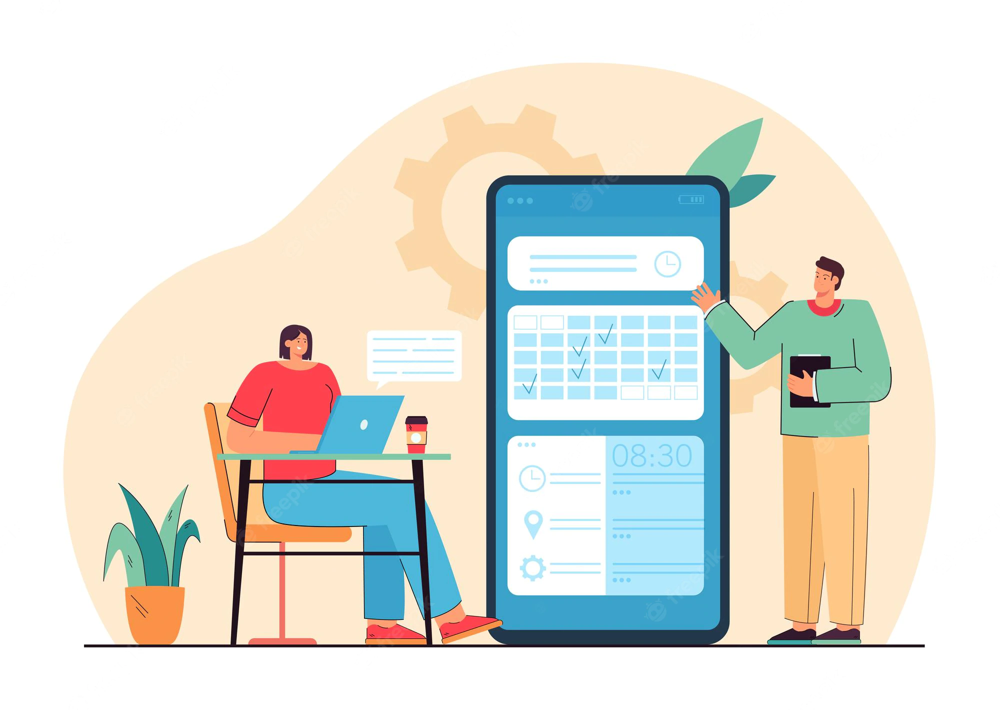

# BetterMeeting

Better Meeting is a web-based video conferencing platform that allows users to have virtual meetings and collaborate with others remotely. It utilizes WebRTC (Web Real-Time Communication) technology, which enables real-time communication through web browsers and native apps without the need for additional plugins or software.

WebRTC is a free, open-source project that provides browsers and mobile apps with Real-Time Communications (RTC) capabilities via simple APIs. It allows for audio and video communication to work inside web pages by allowing direct peer-to-peer communication, eliminating the need for an intermediary such as a server.

In addition to video communication, Better Meeting also includes a chat function for text-based communication and screen sharing capabilities. These features allow users to conduct virtual meetings and collaborate with others remotely, whether they are in the same location or in different parts of the world.

Overall, Better Meeting is a useful tool for businesses and organizations that need to hold virtual meetings or collaborate with team members remotely. Its use of WebRTC technology enables users to easily and securely communicate with each other in real-time, making it an efficient and effective platform for remote work and communication.
